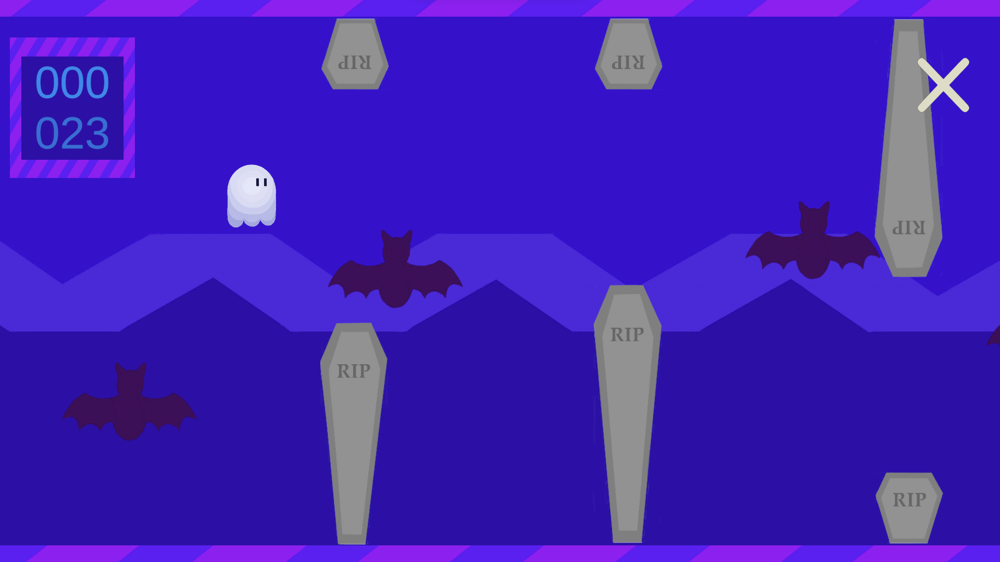
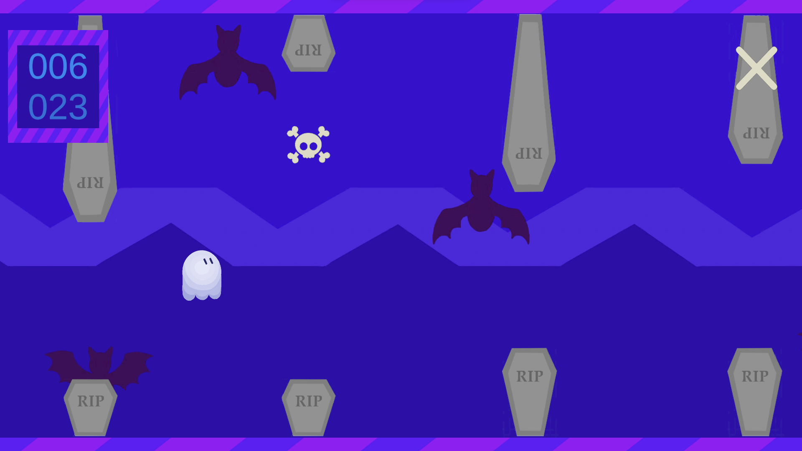
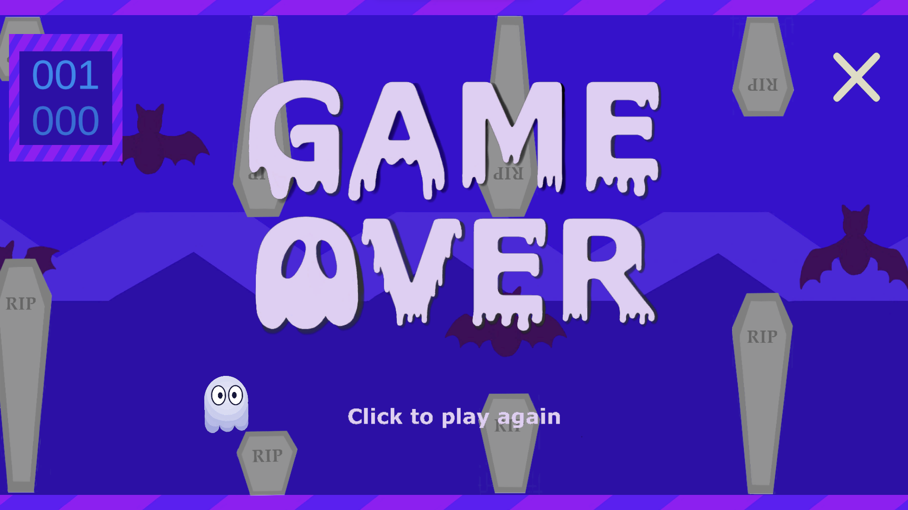
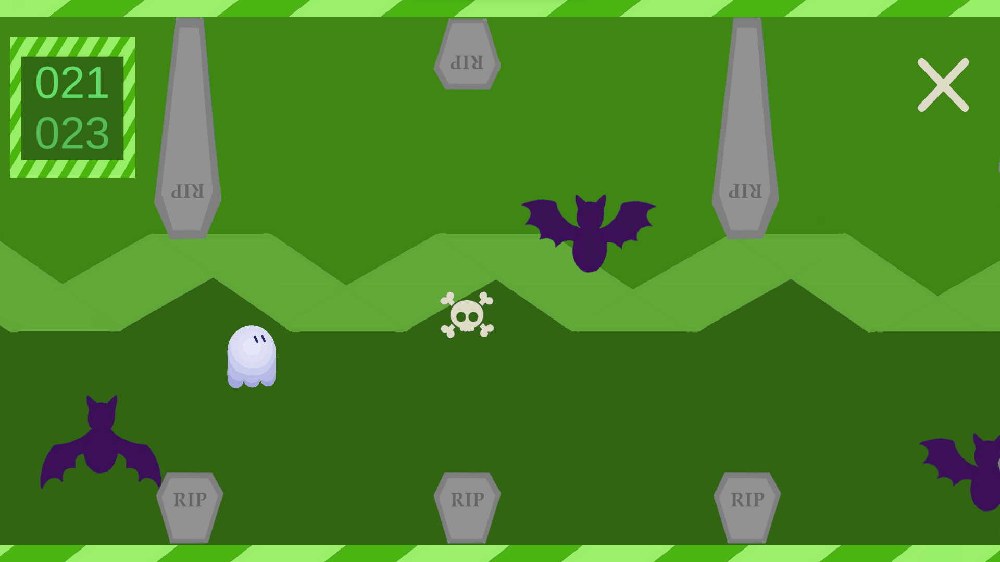

# Flappy Ghost
## Description 👻
Hi! Welcome to my spooky project! 
Flappy Ghost is a game that is based on the famous game "Flappy Bird", but the main character is now a ghost that is trying to get through some tombs and skulls. In contrast to Flappy Bird, I added a feature where some tombs have a skull (that is also an obstacle) that goes from one to the other, adding some difficulty to the game, and the color theme changes from blue to green and vice versa every 20 points. 
For this project, I used the Unity game engine, as well as C# for the scripts. In order to use these tools, I previously took part of the specialization "C# Programming for Unity Game Development" in Coursera, which introduced me to Unity and C#. This gave me some panorama of how to manipulate these tools, finally leading me to develop this game. 
All the graphics and animations used in this game were made by myself, and it was certainly an interesting challenge. 
Throughout the development of this game, I received a lot of feedback of family and friends that helped me to have better animations and different features, so I really appreciate them.

## Install and run the project 💻⚙️
1. Make sure to have previously installed [Unity](https://unity.com/download).
2. Download the ZIP file of the project and unzip it.
3. Open the project in Unity, and import the TextMeshPro folder. 
<i>Window -> TextMeshPro -> Import TMP Essential Resources</i>
4. Open Scene0. 
<i>Assets -> Scenes -> Scene0</i>
5. Build and run the project. 
<i>File -> Build And Run</i>
6. Enjoy!

## How to play 🕹️
To play, click on the screen, use the space bar, or the arrow pointing upwards. This will make the ghost jump.
  
Jump between the tombs to gain points.
  

  
Be careful not to crash with an obstacle!
  

  
Enjoy some color change every 20 points :)
  

  
The first score represents the points gained on the current game, and the second one represents the maximum score of all games since the app was opened (every time it is closed, the maximum score resets).